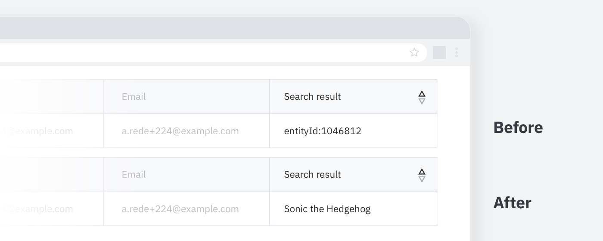

# Replace IDs for titles

Grabs any `eninity:id` from a webpage looks up the article title on wikidata and replaces it 

## Development

`npm i`

 `parcel src/inject.js`

### Build

`parcel build src/inject.js` then zip the `dist` folder

# Development notes

Files from the static folder are copied across with parcel 

